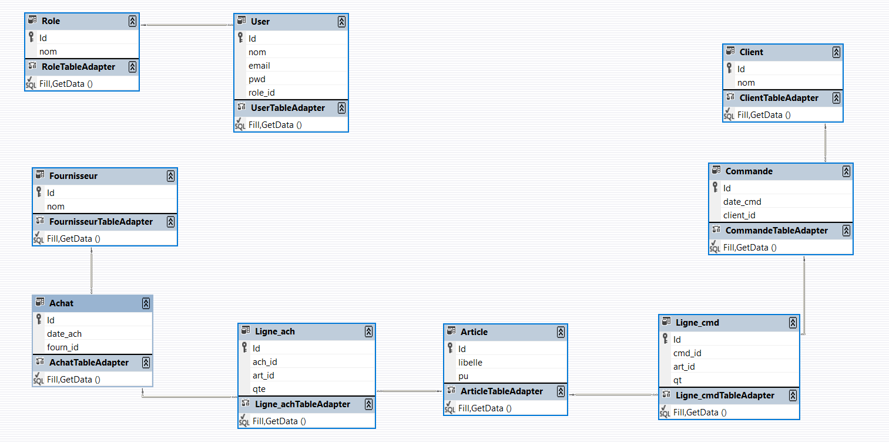

# eCommerce App

The Order Management Application is a desktop application built with Winforms, designed to manage orders. It utilizes the SQL Server datasource to store data.

## Table of Contents

- [Installation](#installation)
- [Usage](#usage)
- [Contributing](#contributing)
- [Database Design](#database-design)
- [App Interface](#app-interface)

## Installation

1. Clone the repository: `git clone (https://github.com/najlae01/order_management.git)`
2. Open the project in your preferred development environment (e.g., Visual Studio)
3. Build the solution to restore any required dependencies and compile the project.

## Usage

1. Configure the database connection string in the application's configuration file.
2. Run the application by clicking the "Start" button in your development environment or by running the compiled executable file.
3. Use the application to manage orders, including creating, editing, and deleting orders.

## Contributing

Contributions to the Order Management Application are welcome! If you want to contribute, follow these steps:

1. Fork the repository.
2. Create a new branch: `git checkout -b feature/your-feature`.
3. Make your changes and commit them: `git commit -m 'Add some feature'`.
4. Push to the branch: `git push origin feature/your-feature`.
5. Submit a pull request.

You can also open an issue in the GitHub repository to report bugs or suggest improvements.

## Database Design

## App Interface

The following screenshots showcase the application's user interface and its functionalities, including adding, deleting, and updating a client, as well as performing these CRUD operations on other tables.

